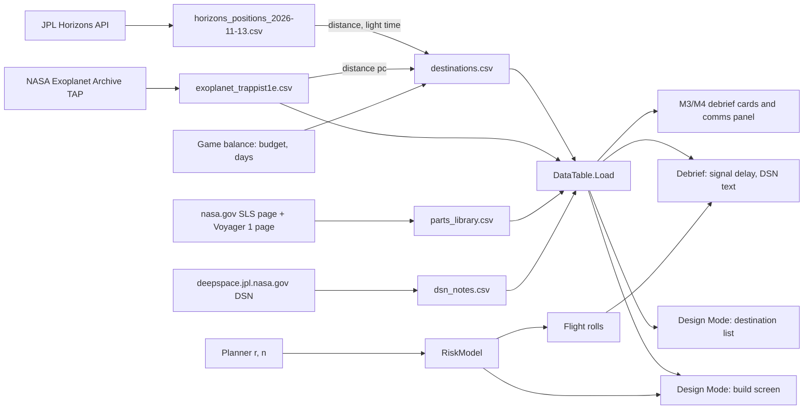

# Data flow: source -> CSV -> screen

```mermaid
flowchart LR
  H[JPL Horizons API] --> C1[horizons_positions_2026-11-13.csv]
  EX[NASA Exoplanet Archive TAP] --> C2[exoplanet_trappist1e.csv]
  SLS[nasa.gov SLS page + Voyager 1 page] --> C3[parts_library.csv]
  DSN[deepspace.jpl.nasa.gov DSN] --> C4[dsn_notes.csv]
  C1 -->|distance, light time| C5[destinations.csv]
  C2 -->|distance pc| C5
  GB[Game balance: budget, days] --> C5
  C5 --> DT[DataTable.Load]
  C2 --> DT
  C3 --> DT
  C4 --> DT
  DT --> S1[Design Mode: destination list]
  DT --> S2[Design Mode: build screen]
  DT --> S3[Debrief: signal delay, DSN text]
  DT --> S4[M3/M4 debrief cards and comms panel]
  PL[Planner r, n] --> RM[RiskModel] --> S2
  RM --> S5[Flight rolls] --> S3
```

Rule: a number on screen is either read from a CSV row with a `source_url`, or is labelled GAME BALANCE.
